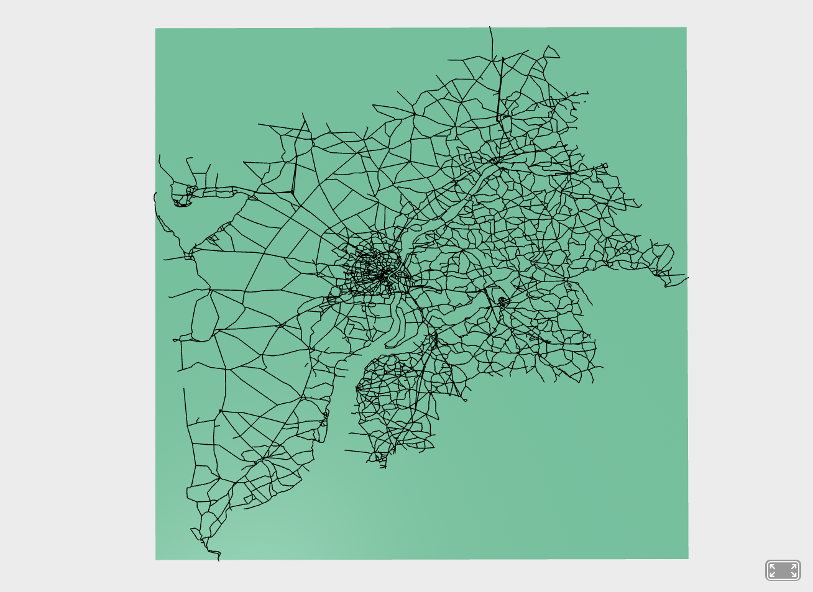

# Norton
projet de stage avec Aframe et three.js

- 19/02
Aujourdhui j'ai fais en sorte que les routes suivent correctement l'orientation en utilisant une box pour a route en elle-même et la trigonométrie pour calculer l'angle.

-28/02
données routes :
-visum, transcad = logiciel payant cher
-route 500 => base de donnée routière qui à l'air complète mais trop gros à ouvrir

-15/03
 framerate entre 100 et 120